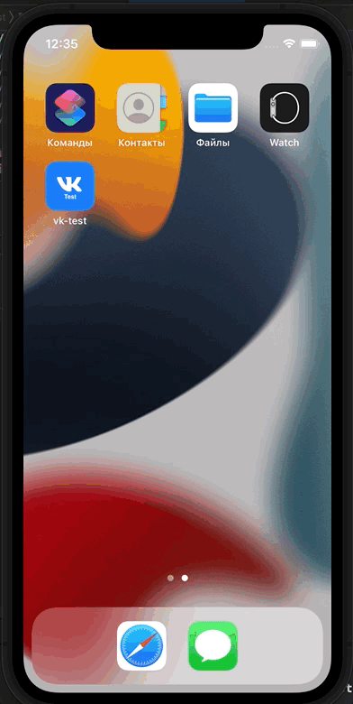

<!-- TABLE OF CONTENTS -->

  
Table of Contents

  <ol>
    <li>
      <a href="#about-the-project">About The Project</a>
    </li>
    <li><a href="#demo">Demo</a></li>
    <li><a href="#license">License</a></li>
    <li><a href="#contact">Contact</a></li>
  </ol>

<!-- ABOUT THE PROJECT -->
## About The Project

Необходимо разработатьп риложение, отображающее информацию о сервисах VK.

[JSON](https://publicstorage.hb.bizmrg.com/sirius/result.json) с данными. По нажатию на какой-либо из сервисово открывается либо его сайт, либо мобильное приложение, если оно установлено.

В качестве технического стека были взяты Storyboards без сторонних библиотек для разработки приложения в сжатые сроки. 

(<a href="#top">back to top</a>)

<!-- DEMO -->
## Demo

 

(<a href="#top">back to top</a>)

<!-- LICENSE -->
## License

Distributed under the MIT License. See `LICENSE.txt` for more information.

(<a href="#top">back to top</a>)

<!-- CONTACT -->
## Contact

Ivan Surganov - [@isurganov](https://www.linkedin.com/in/ivansurganov/) - devsurganov@gmail.com

Project Link: [https://github.com/isurganov/vk-test](https://github.com/isurganov/vk-test)

(<a href="#top">back to top</a>)

